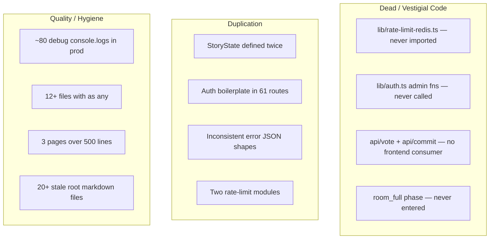

# Codebase Refactoring Plan

## Current state

61 API routes, 19 lib modules, 4 components, 27 pages, 21 test files. The project has grown fast and accumulated structural debt across several categories. Nothing is broken, but there is significant redundancy, dead code, and type duplication that will compound as the product evolves.




---

## Priority 1 — Dead code removal (low risk, immediate clarity)

### 1a. Delete `lib/rate-limit-redis.ts`

This file is not imported by any `.ts` or `.tsx` file — only mentioned in markdown docs. Its in-memory fallback duplicates `lib/rate-limit.ts`. Remove the file and the two markdown references.

### 1b. Remove vestigial admin auth from `lib/auth.ts`

`createAdminSession`, `isAdminAuthenticated`, and `deleteAdminSession` are never called from any route or page. All admin auth flows go through [lib/auth-organiser.ts](lib/auth-organiser.ts) (`requireAdminAuth`, `requireSuperAdminAuth`). Remove the three dead functions and the `ADMIN_SESSION_COOKIE` constant from `lib/auth.ts`.

### 1c. Audit `api/vote/route.ts` and `api/commit/route.ts`

No frontend page or component fetches `/api/vote` or `/api/commit`. The story-beats runtime replaced the old "vote on options, then commit" flow. These routes (and the `Vote`/`DecisionCommit` models) are vestigial. Flag for removal or deprecation after confirming with you that the old flow is fully retired.

### 1d. Remove `room_full` phase handling

After the join-route change that auto-transitions to `ready_check`, the `room_full` phase is never entered. The literal `'room_full'` still appears in:

- [lib/story-runtime.ts](lib/story-runtime.ts) (type definition)
- [app/api/room/join/route.ts](app/api/room/join/route.ts)
- [app/api/room/[id]/start/route.ts](app/api/room/[id]/start/route.ts)
- [app/api/room/[id]/runtime/ready-check/route.ts](app/api/room/[id]/runtime/ready-check/route.ts)
- [app/api/admin/rooms/route.ts](app/api/admin/rooms/route.ts)
- [app/room/[id]/play/page.tsx](app/room/[id]/play/page.tsx)

Keep it in the union type for backward-compat with existing DB rows, but remove all branching logic that handles it distinctly from `ready_check`.

---

## Priority 2 — Type consolidation and shared imports

### 2a. Export and reuse `StoryState` from `lib/story-runtime.ts`

`app/room/[id]/play/page.tsx` redefines the entire `StoryState`, `RoomPhase`, `RollBand` types locally (lines 7-52). These drift from the canonical definitions in [lib/story-runtime.ts](lib/story-runtime.ts). Replace the local types with:

```typescript
import type { StoryState, RoomPhase, RollBand } from '@/lib/story-runtime';
```

Same for `DecisionOption` / `QuestDecisionData` — extract a shared `lib/types.ts` or co-locate with existing modules.

### 2b. Install `@types/web-push`

The current [global.d.ts](global.d.ts) declares `declare module 'web-push'` which gives everything `any`. Install the proper type package (or write a minimal declaration with the types actually used: `setVapidDetails`, `sendNotification`, `PushSubscription`).

---

## Priority 3 — API layer deduplication

### 3a. Create `lib/api-helpers.ts` with shared response and error utilities

Every route manually builds `NextResponse.json({ error: '...' }, { status: ... })`. Extract:

```typescript
export function jsonOk<T>(data: T) { ... }
export function jsonError(message: string, status: number) { ... }
export function withAuth(handler: (user: User, req: NextRequest) => Promise<NextResponse>) { ... }
export function withOrganiserAuth(handler: ...) { ... }
export function withAdminAuth(handler: ...) { ... }
```

The `with*Auth` wrappers eliminate the repeated try/catch + auth check + 401/500 pattern across all 61 routes. Adopt incrementally — start with the 6 `runtime/*` routes that share near-identical structure.

### 3b. Consolidate rate limiting into one module

Keep [lib/rate-limit.ts](lib/rate-limit.ts) as the single implementation (it is the only one actually imported). If Redis support is needed later, add it there behind a feature flag rather than maintaining a parallel file.

---

## Priority 4 — Console.log cleanup

### 4a. Remove debug logging from `app/room/[id]/page.tsx`

This file has ~15 `console.log('[EchoRoom] ...')` statements for push notification debugging. These should not ship to production. Remove them all.

### 4b. Strip verbose logging from `app/api/organiser/events/[id]/generate/commit/route.ts`

This file has ~17 `console.log` calls that trace the commit flow step-by-step. Replace with a single structured error log in the catch block.

### 4c. General pass: downgrade remaining `console.log` to `console.debug` or remove

About 80 `console.error`/`console.log` calls across routes. The `console.error` in catch blocks is fine (keep those). The `console.log` calls used for debugging should be removed.

---

## Priority 5 — Component decomposition

### 5a. Break up `app/room/[id]/play/page.tsx` (~690 lines)

Extract phase-specific sections into standalone components:

- `BriefingReadyPhase` — the beat-0 briefing + ready button block
- `BeatInputPhase` — the preamble/action input/paths block
- `RollRevealPhase` — the revealed-actions + d20 card
- `BeatConsequencePhase` — the consequence display + continue
- `FinalPanelPhase` — scoreboard + synthesis + finish

Each receives `storyState`, `players`, `currentBeat`, and the relevant callbacks as props. The parent page becomes a phase router under 100 lines.

### 5b. Break up `app/organiser/events/[id]/page.tsx` (~957 lines)

This is the largest file. Extract tab-content sections (event details, codes management, generation panel) into separate components.

### 5c. Break up `app/organiser/insights/page.tsx` (~536 lines)

Extract filter controls, chart sections, and table sections into components.

---

## Priority 6 — Type safety improvements

### 6a. Replace `as any` in production code

12 files have `as any` assertions. The most impactful to fix:

- [app/api/room/[id]/route.ts](app/api/room/[id]/route.ts) line 104 — cast `storyState` from JSON
- [lib/artifact.tsx](lib/artifact.tsx) line 58 — cast room data
- [app/api/organiser/login/route.ts](app/api/organiser/login/route.ts) lines 33, 60

Most can be replaced with proper type guards or Zod parsing.

### 6b. Standardize error handling in catch blocks

Some routes use `catch (error: any)`, some `catch (error: unknown)`, some just `catch (error)`. Standardize on `catch (error: unknown)` with a shared `getErrorMessage(error: unknown): string` helper.

---

## Priority 7 — Data model hygiene

### 7a. Migrate away from `decisionsData` string field

The `Quest.decisionsData` field is marked `// DEPRECATED` in the schema but is still read by:

- [app/api/room/[id]/route.ts](app/api/room/[id]/route.ts)
- [app/api/organiser/quests/[id]/route.ts](app/api/organiser/quests/[id]/route.ts)
- [app/api/organiser/quests/[id]/revert/route.ts](app/api/organiser/quests/[id]/revert/route.ts)
- [app/room/[id]/play/page.tsx](app/room/[id]/play/page.tsx)
- [lib/artifact.tsx](lib/artifact.tsx)

These all parse `decisionsData` as JSON to get beat metadata. They should instead query the `QuestDecision` + `QuestOption` relations directly. This eliminates the dual-write pattern and the need for JSON string parsing.

### 7b. Consolidate auth.ts

Merge participant session logic and organiser session logic into a clearer separation — or at minimum document that `lib/auth.ts` is participant-only and `lib/auth-organiser.ts` is organiser/admin-only, and remove the dead admin functions from `auth.ts`.

---

## Priority 8 — Housekeeping

### 8a. Clean up root markdown files

20+ markdown files at the repo root. Many are from early phases (SQLITE_MIGRATION_GUIDE, MERGE_STRATEGY, FIX_DATABASE_MISMATCH, etc.) and are likely stale. Move to a `docs/archive/` directory or delete after confirming with you which are still relevant.

### 8b. Remove `asd.txt` and `prisma/dev.db-journal`

Scratch files that shouldn't be in the repo.

### 8c. Badge system N+1 queries

[lib/badges.ts](lib/badges.ts) `checkRoomCompletionBadges` runs ~10 sequential DB calls per member (badge lookup, existing check, create). `getProgressTowardBadges` runs per-badge-type queries in a loop. These could be batched with `Promise.all` or aggregated into fewer queries. Lower priority since badges are awarded infrequently.

---

## What this does NOT touch

- No schema migrations (all changes are code-level).
- No feature removals — the vote/commit routes are flagged for your decision.
- No UI redesign — component decomposition preserves existing markup.
- No dependency upgrades (Next 14 to 15, etc.) — that's a separate effort.

